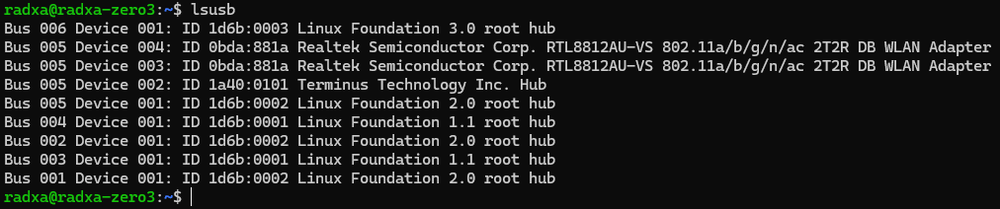

## A Radxa Zero 3W stackable double BL-R8812AF1 board

### The board integrates an SL2.1A USB hub chip which splits a single USB interface into 4 interfaces: two are used by the WiFi modules, and two additional ones are broken out for use with anything else (keyboard for configuration, USB stick, more WiFi dongles etc.).

## HOW TO MAKE
### You can order the PCB by sending the gerber files in the .zip to a PCB manufacturer. I have also included the source Kicad project files if you want to make any modifications.

