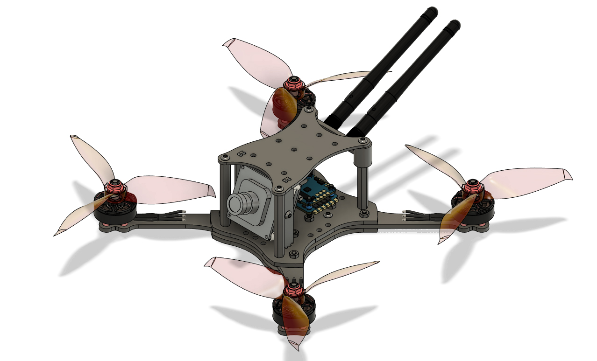
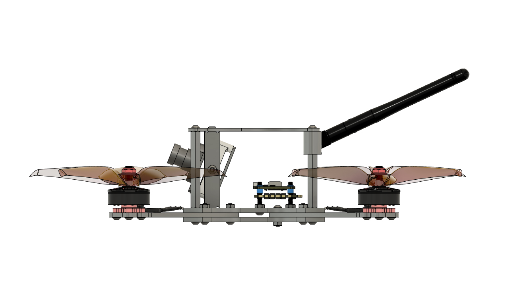
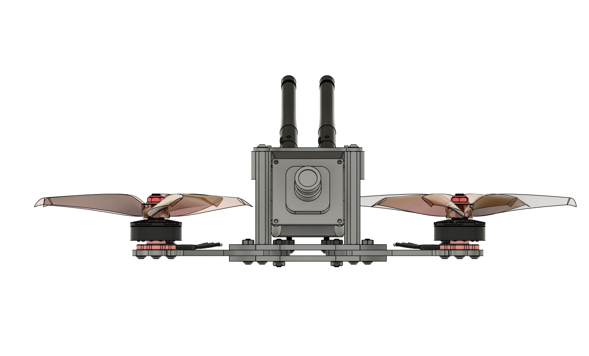
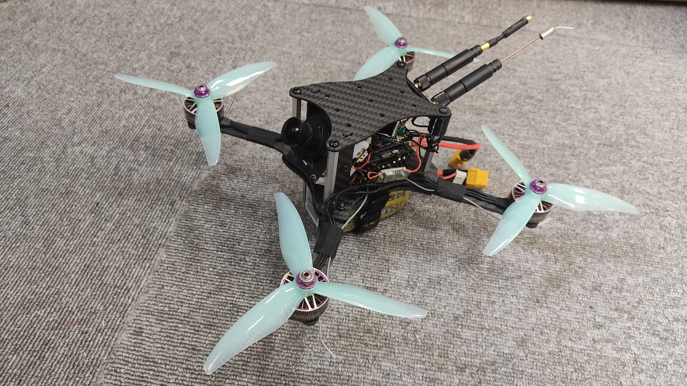
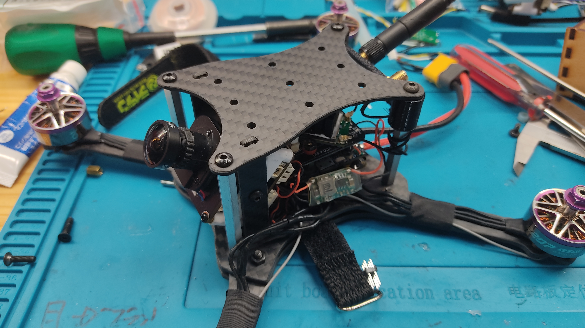

## 5 inch racing drone equipped with OpenIPC
### OpenIPC-5inchRacer v4.f3d:  3D CAD file for AUTODESK FUSUION360
### OpenIPC-5inchRacer v4.zip:  3D CAD file for AUTODESK INVENTOR

## HOW TO MAKE
### Ask a friend who has a CNC to cut the data in the CARBON folder!

