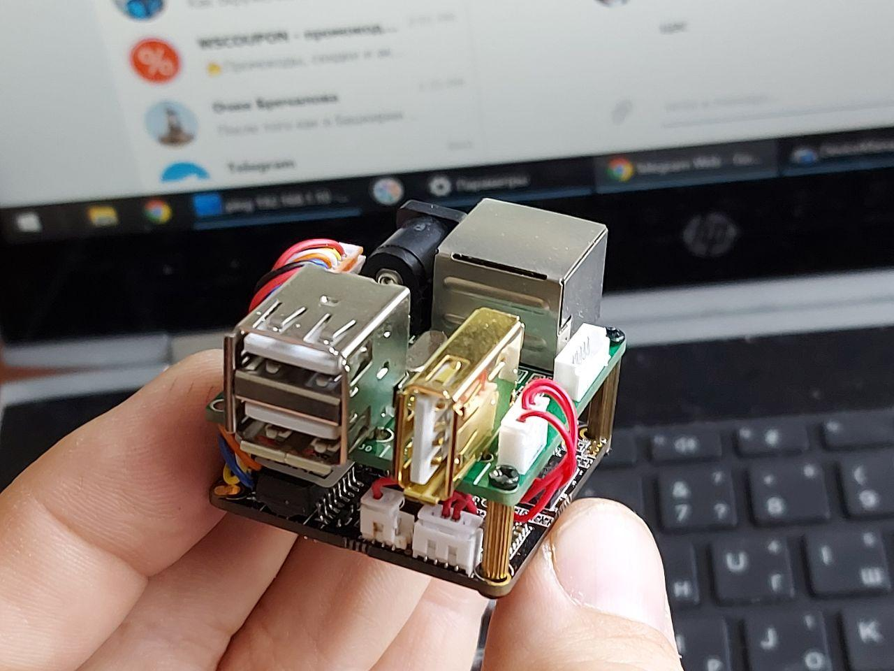

![OpenIPC logo][logo]

## OpenIPC hardware developments 

[][telegram]

### A collection of hardware developments by the OpenIPC team

- [One of the open board for OpenIPC](board_hi3516ev200)
- [8812AU module dock board for camera,input 6V@2A max and 28V@ 3A max](/module_38x38_r8812au_6v2a)
- [WIFI board for stacking on 20mm square hole flight controller for FPV](WIFI-BOARD)

### A collection of 3D models for use in OpenIPC projects

- [OpenIPC models on Printables site](https://www.printables.com/search/models?q=tag:openipc)

More information about the [project][project] is available in our [website][website]
and on the [wiki][wiki].

[firmware]: https://github.com/openipc/firmware/
[logo]: https://openipc.org/assets/openipc-logo-black.svg
[mit]: https://opensource.org/license/mit/
[opencollective]: https://opencollective.com/openipc
[paypal]: https://www.paypal.com/donate/?hosted_button_id=C6F7UJLA58MBS
[project]: https://github.com/openipc/
[telegram]: https://t.me/OpenIPC
[website]: https://openipc.org/
[wiki]: https://github.com/openipc/wiki/
