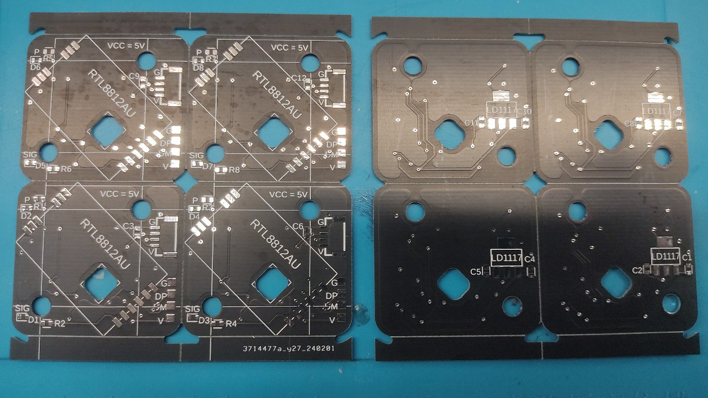
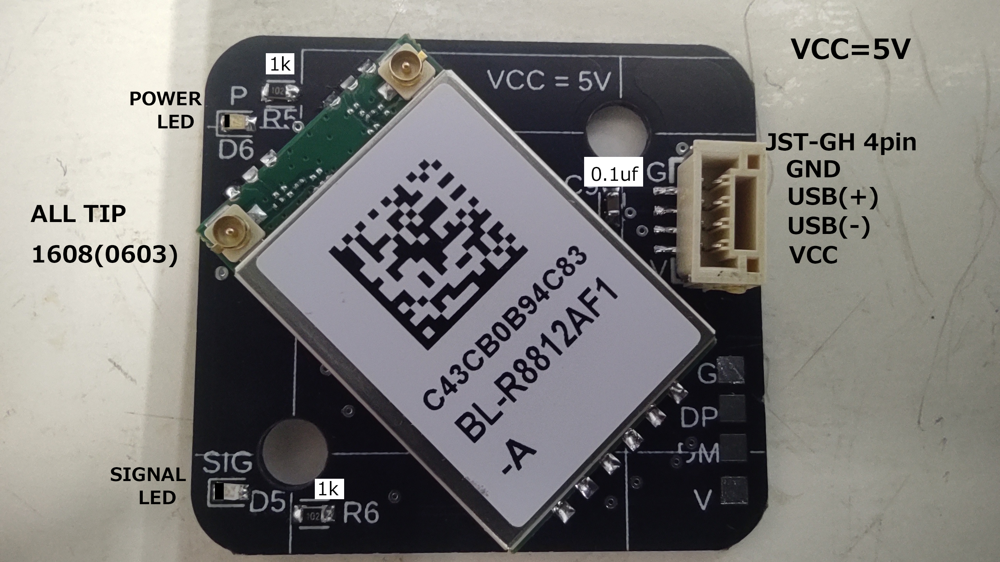
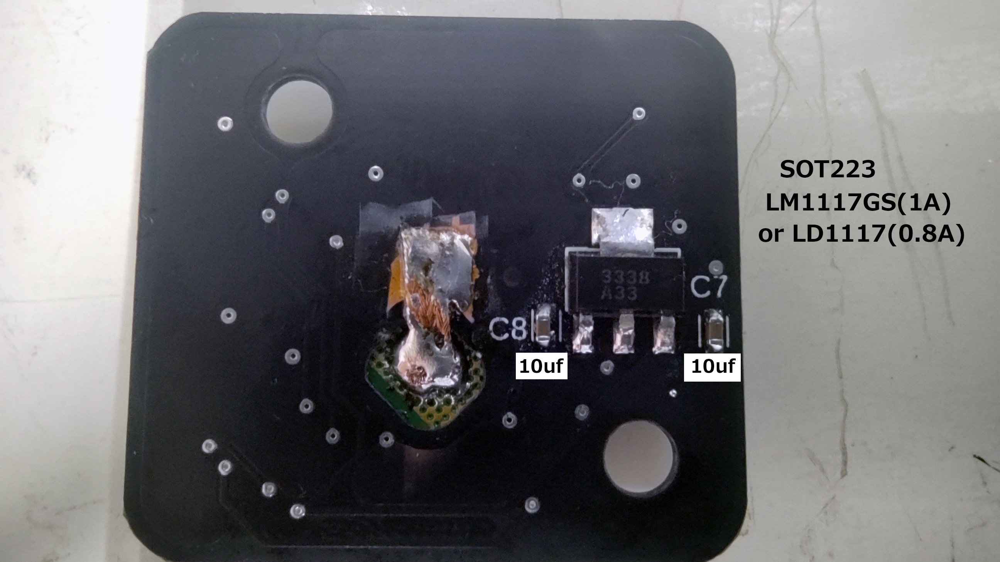
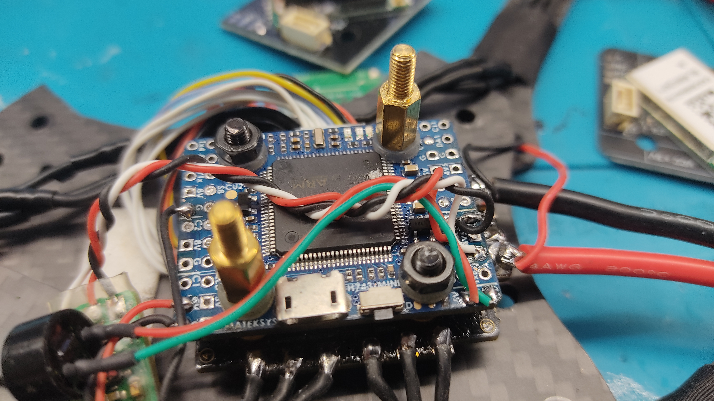

## WIFI board for stacking on 20mm square hole flight controller for FPV
### *.f3z: EAGLE file for FUSUION360
### *.sch: Schematic file for EAGLE
### *.brd: Board file for EAGLE
### *.zip: Gerber data for sending to the board manufacturing company that includes this board as a set of 4

### HOW TO USE
Prepare a standoff of this shape

Attach it to the flight controller installation screw like this

Install this WIFI module on it.

