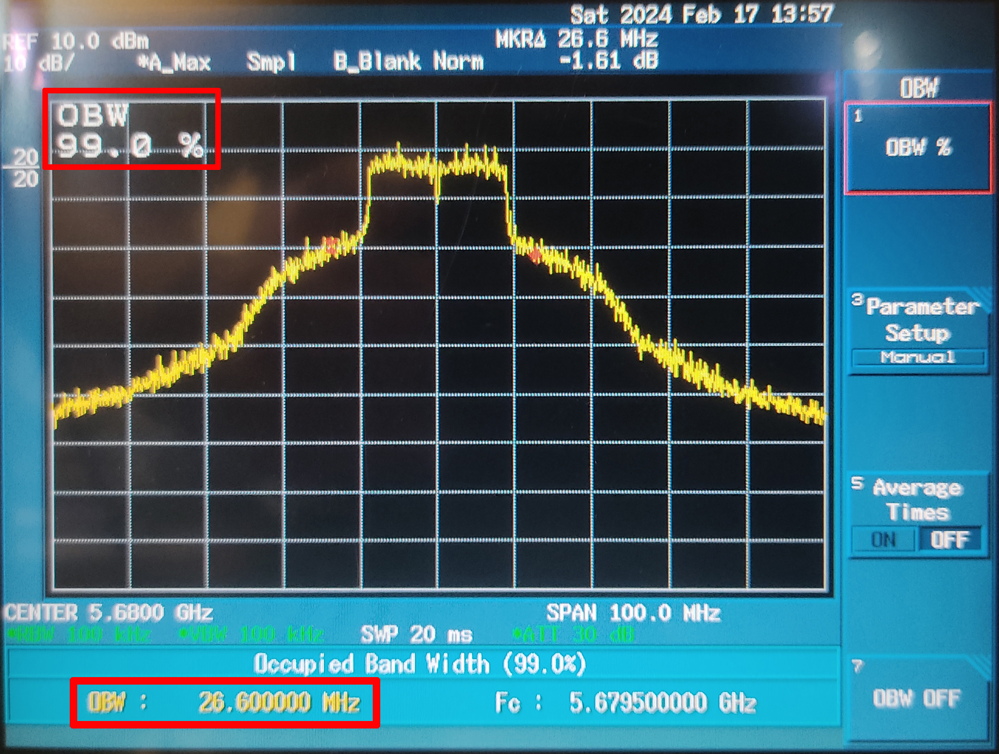
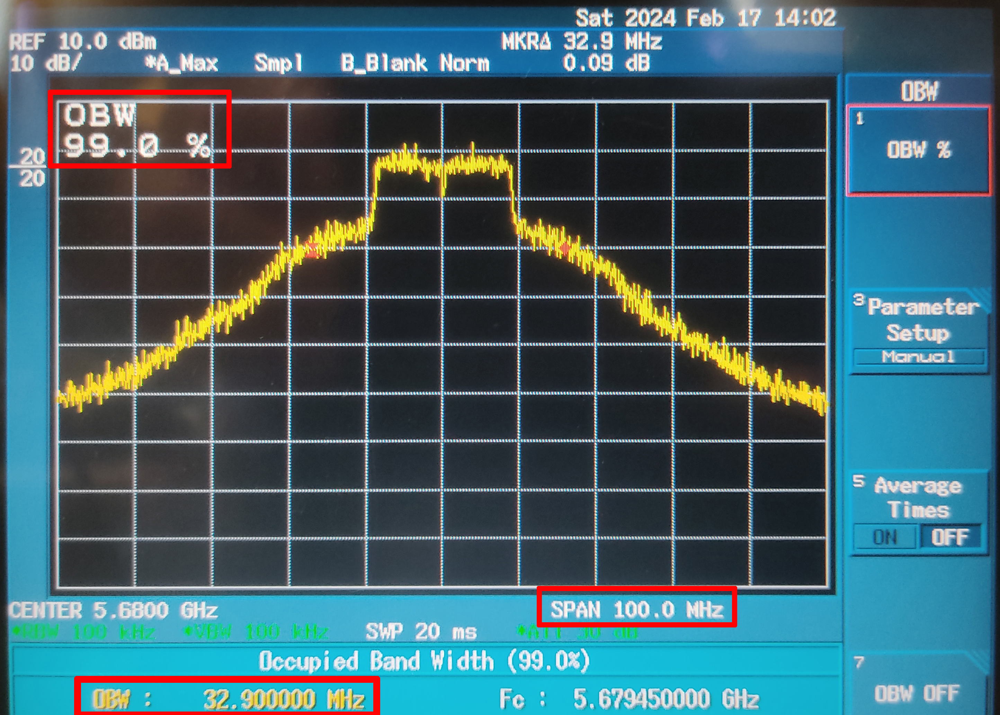
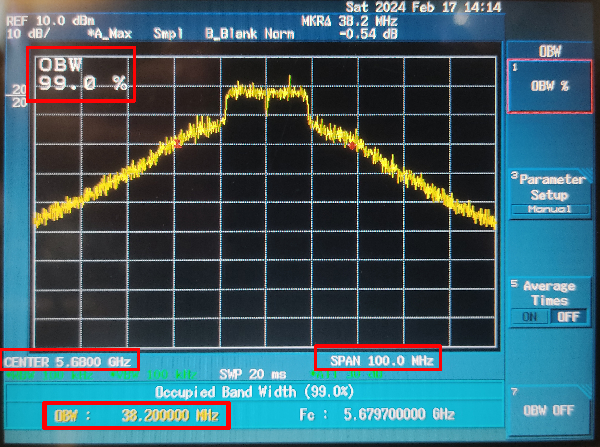
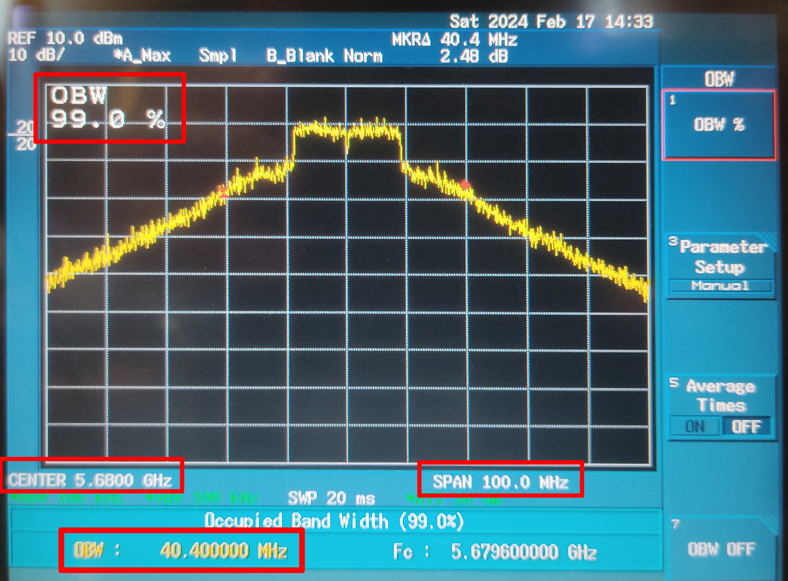

# Transmitter OBW(occupied band width) when changing drivers from 45 to 58 in increments of 5
- 40 or less is omitted because the OBW is less than 20Mhz
## driver_txpower_override 45    OBW 26.6Mhz

## driver_txpower_override 50    OBW 32.9Mhz

## driver_txpower_override 55   OBW 38.2Mhz

## driver_txpower_override 58   OBW 40.4Mhz

