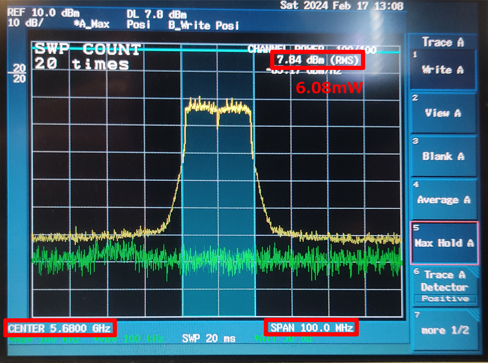
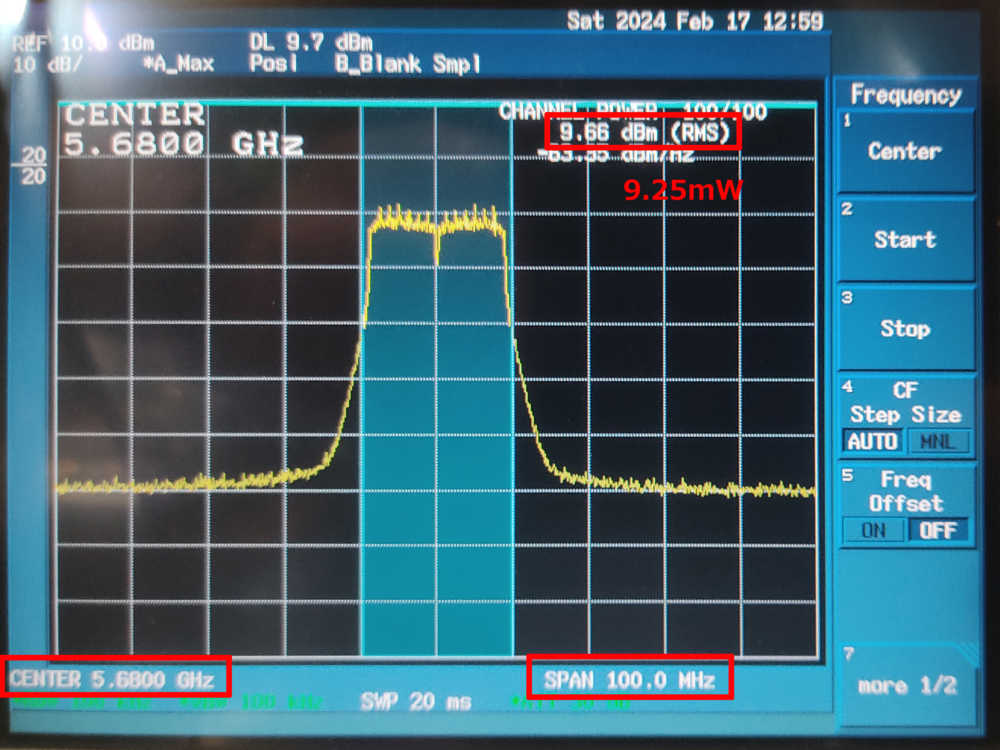
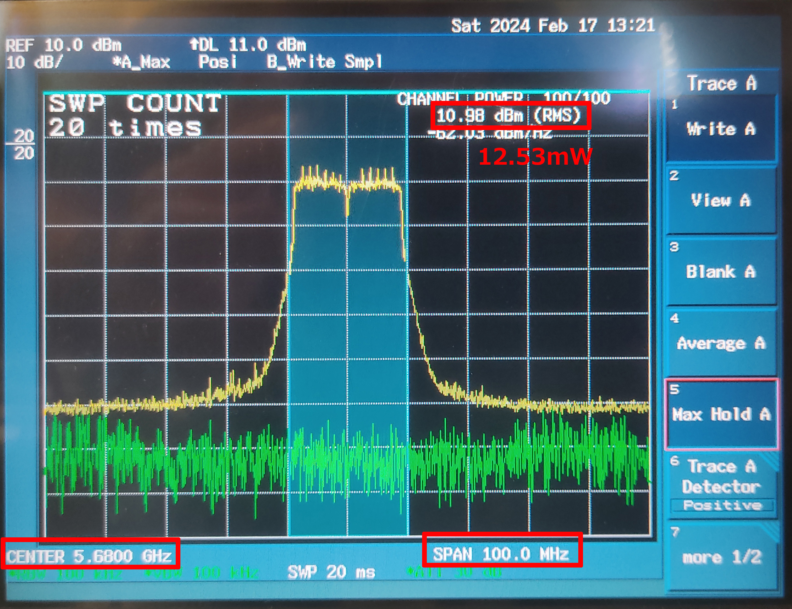
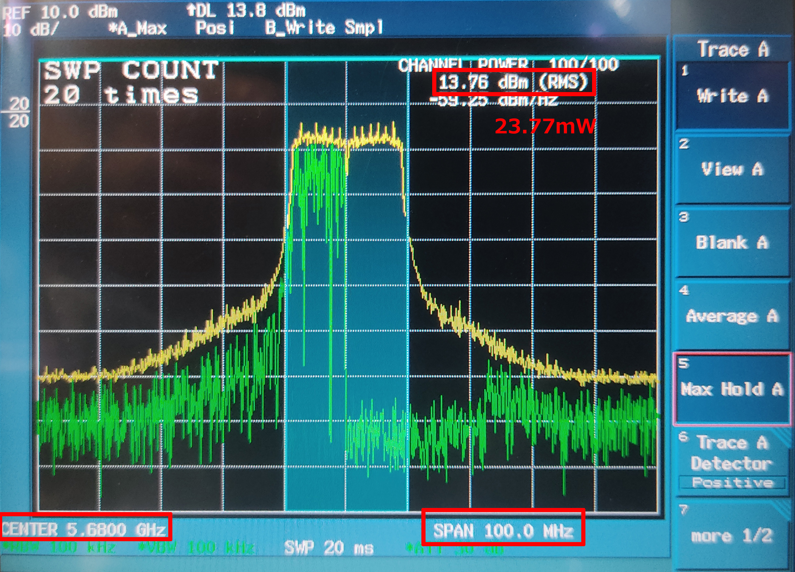
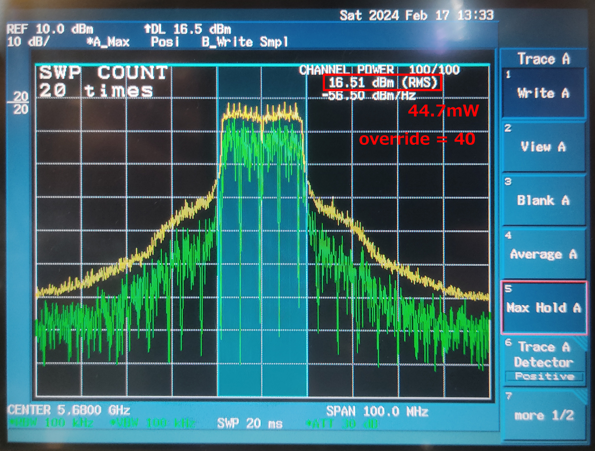
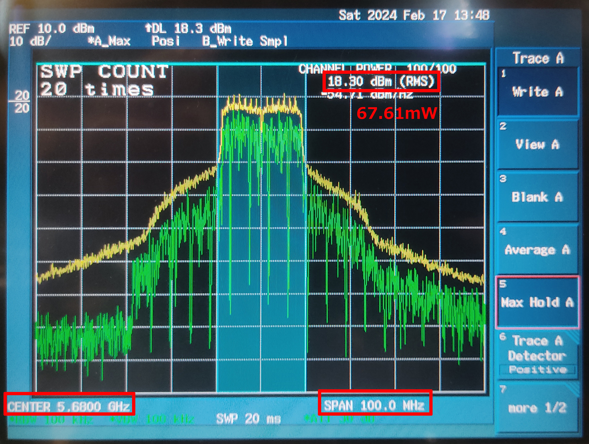
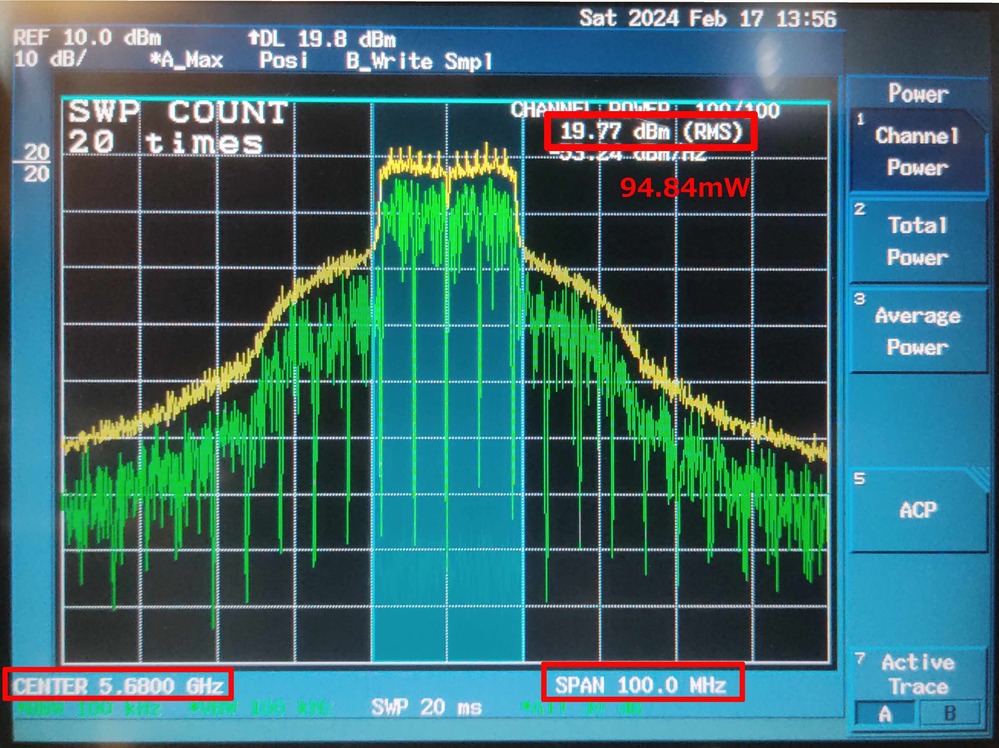
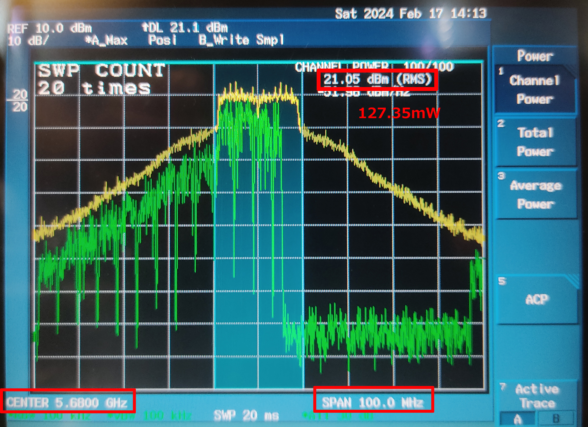
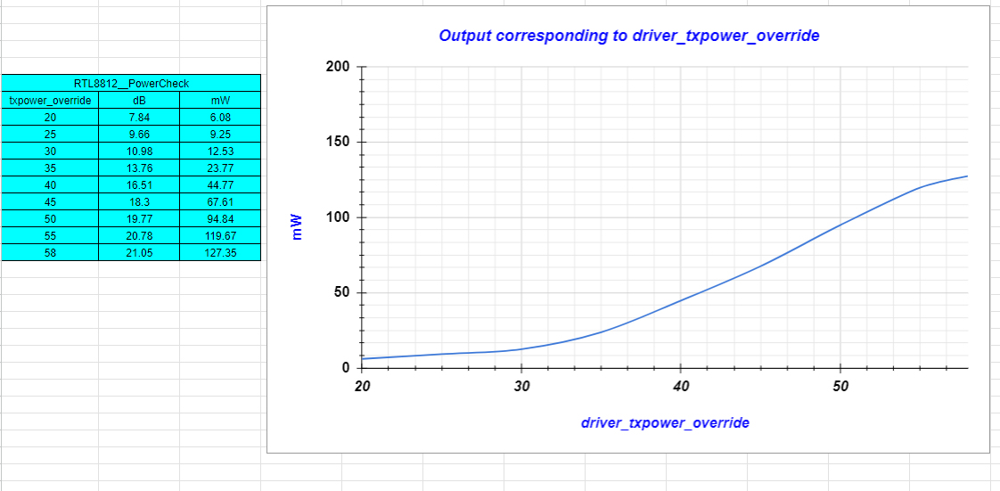

# Transmitter OBW(occupied band width) when changing drivers from 45 to 58 in increments of 5
## driver_txpower_override 20

## driver_txpower_override 25

## driver_txpower_override 30

## driver_txpower_override 35

## driver_txpower_override 40

## driver_txpower_override 45

## driver_txpower_override 50

## driver_txpower_override 55

## driver_txpower_override 58

## SUMMARY

