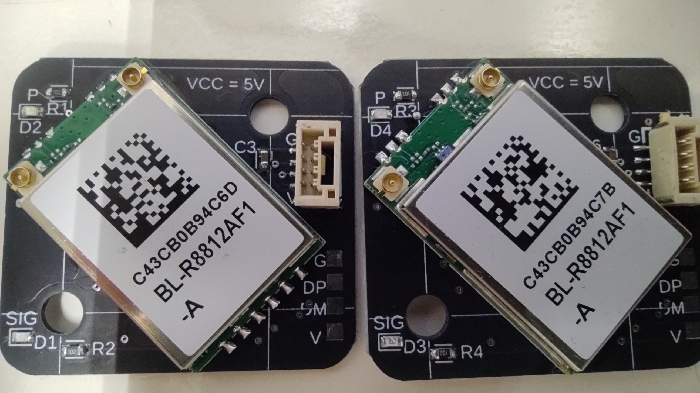
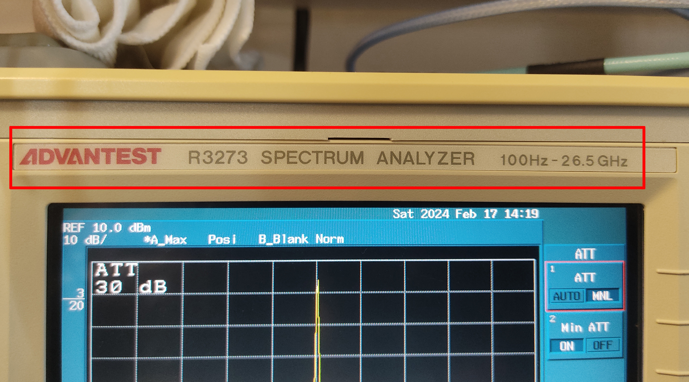
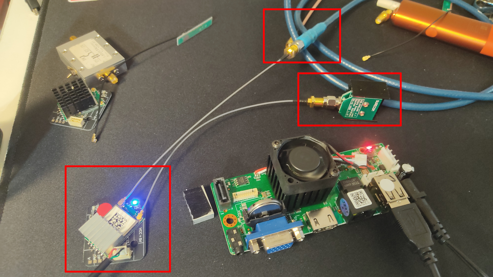

## RTL8812AU output measurement

- ****We measured the output when changing the value of driver_txpower_override in wfb.conf from 20 to 58.****

-  ****Equipment used: ADVANTEST R3273 100hz~26.5Ghz****

- ****The measurement method was to connect one of the two systems to a dummy load and the other directly to the spectrum analyzer.****

## [OUTPUT POWER](POWER.md)

### HOW TO USE
Prepare a standoff of this shape

Attach it to the flight controller installation screw like this

Install this WIFI module on it.

